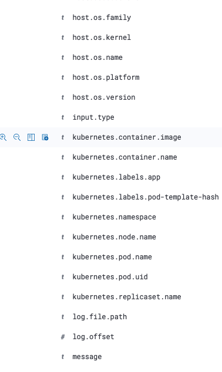

# daemonset抽取容器日志方案
- 容器日志写入hostpath方式挂载的卷，即直接写到容器宿主机
- 宿主机上的日志路径，以容器名方式进行区分，在容器启动时自动创建
- firebeat daemonset直接读取宿主机路径中的日志
- 通过`filebeat.autodiscover`参数中`kubernetes`类型的`providers`来获取容器相关信息
- 日志中可以获取一些容器应用相关的标签
  > []
